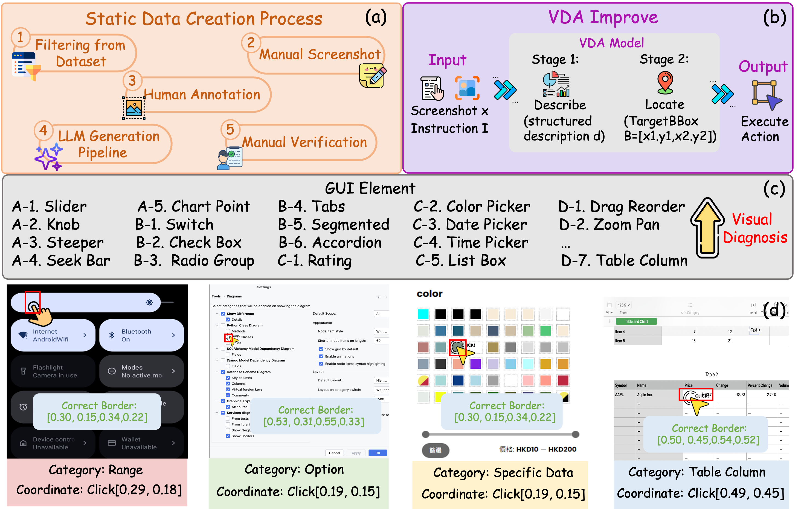

# 🎯 FineState-Bench

[](https://huggingface.co/datasets/wumiaoshou/Static-FineBench)
[](LICENSE)
[](https://www.python.org/)


 
🤗 **Bench**: [HuggingFace Hub](https://huggingface.co/datasets/wumiaoshou/Static-FineBench)

---

FineState-Bench is the first comprehensive benchmark and diagnostic framework designed for fine-grained state control in GUI agents across desktop, web, and mobile environments. This project addresses the critical evaluation gap in current GUI agent benchmarks by shifting focus from coarse-grained task completion to precise state manipulation and control capabilities.

## ✨ Features

- 🎯 **Fine-Grained State Control**: First benchmark focusing on precise state manipulation rather than coarse task completion
- 🌐 **Multi-Platform Coverage**: Comprehensive evaluation across desktop, web, and mobile environments
- 🔍 **Diagnostic Framework**: Integrated VDA (Visual Diagnostic Assistant) for quantitative bottleneck analysis
- 📦 **Dual-Bounding-Box Annotation**: Separate evaluation of localization and interaction capabilities
- 📊 **Multi-Dimensional Metrics**: Four-phase evaluation system (Loc SR, Int SR, SA-Locate SR, SA-Interact SR)
- 📋 **2,257 High-Quality Tasks**: Carefully curated static interaction scenarios across four component categories
- 🔌 **Plug-and-Play VDA**: Enables controlled experiments to isolate visual grounding effects
- 🤖 **Comprehensive Model Support**: Evaluation of 13+ representative models including commercial and open-source systems

## 📁 Project Structure

```
FineState-Bench/
├── 📂 config/
│   └── models_config.yaml          # Model configurations
├── 📂 evaluation/
│   ├── benchmark.py                # Main benchmark evaluation logic
│   ├── LLM_eval.py                 # LLM-based evaluation utilities
│   ├── Plug_and_play_model.py      # VDA (Visual Diagnostic Assistant)
│   ├── model_clients.py            # Base model client classes
│   ├── 📂 model_client/            # Specific model implementations
│   │   ├── chatglm_client.py
│   │   ├── ui_r1_client.py
│   │   ├── minicpmv_client.py
│   │   └── ...
│   └── utils.py                    # Utility functions
├── 🖥️ desktop.sh                   # Desktop evaluation script
├── 🌐 web.sh                       # Web evaluation script
├── 📱 mobile.sh                    # Mobile evaluation script
├── test_all_models_distributed.py  # Distributed testing script
└── download.py                     # Model download utilities
```

## 🚀 Installation

1. 📥 **Clone the repository:**
```bash
git clone https://github.com/AnonymousThewarehouse/FineState-Bench.git
cd FineState-Bench
```

2. 📊 **Download the dataset from HuggingFace:**
```bash
# Download the FineStateBench dataset
# download from HuggingFace datasets:
# https://huggingface.co/datasets/Willtime2006/Static-FineBench
```

3. 📦 **Install dependencies:**
```bash
pip install -r requirements.txt
```

4. ⚙️ **Configure your models in `config/models_config.yaml`** (see Configuration section below)

## ⚙️ Configuration

### 🔧 Model Configuration

Edit `config/models_config.yaml` to configure your models. The file supports both online and offline models:

**🌐 Online Models** (API-based):
```yaml
google/gemini-2.5-flash-preview:
  model_type: online
  api_url: https://openrouter.ai/api/v1/chat/completions
  api_key: your-api-key
  description: Google Gemini 2.5 Flash Preview
```

**💾 Offline Models** (Local):
```yaml
GUI-R1-7B:
  model_type: offline
  weights_path: models/GUI-R1-7B/GUI-R1-7B
  description: GUI-R1-7B GUI interaction model
  params:
    max_tokens: 1024
    temperature: 0.1
```

## 🎮 Usage

### 🖥️ Desktop Evaluation
```bash
# Run desktop evaluation
./desktop.sh

# Or use Python directly
python -m evaluation.benchmark --platform desktop --model GUI-R1-7B --limit 10
```

### 🌐 Web Evaluation
```bash
# Run web evaluation
./web.sh

# Or use Python directly  
python web.py --model Holo1-7B --limit 5 --scenario 1
```

### 📱 Mobile Evaluation
```bash
# Run mobile evaluation
./mobile.sh

# Or use Python directly
python mobile.py --model SpiritSight-Agent-8B --limit 10
```

### 🔄 Distributed Testing
```bash
# Test all models with distributed processing
python test_all_models_distributed.py --limit 5 --use_cache
```

### 🎯 Single Model Testing
```bash
# Test a specific scenario
python test_scenario.py --model AgentCPM-GUI --scenario 1
```

## 📋 Command Line Options

- `--model`: Specify the model name (from config file)
- `--limit`: Number of test cases to evaluate (default: 5)
- `--scenario`: Evaluation scenario (1, 2, or 3)
- `--use_cache`: Use cached results when available
- `--detector_model`: Specify component detection model
- `--use_ground_truth`: Use ground truth for evaluation

## 📊 Evaluation Metrics

FineState-Bench employs a four-phase evaluation system designed to separate localization from interaction capabilities:

- 🎯 **Locate Success Rate (Loc SR)**: Measures whether the agent's predicted interaction point falls within the target UI element's bounding box
- ⚡ **Interact Success Rate (Int SR)**: Measures whether the interaction successfully brings the target UI element to the intended target state
- 🎯 **Single-Action Locate Success Rate (SA-Locate SR)**: Requires accurate target localization in the very first action
- ⚡ **Single-Action Interact Success Rate (SA-Interact SR)**: Our primary metric, requiring both accurate localization and precise state manipulation in a single action

This hierarchical structure enables fine-grained diagnosis of agent failures, distinguishing between visual perception errors and execution errors.

## 📈 Results

Evaluation results are saved in the `results/` directory, organized by:
- Model type (online/offline)
- Model name
- Evaluation scenario
- Timestamp

## 🤖 Supported Models

### 💼 Commercial Models
- **GPT-4o**: OpenAI's latest multimodal model
- **Claude-3.5-Sonnet**: Anthropic's advanced reasoning model
- **Gemini-2.5-Flash**: Google's fast multimodal model

### 🔓 Open-Source GUI Agents
- **UGround-7B**: Specialized GUI grounding model
- **OS-Atlas-7B**: Open-source GUI agent with strong localization
- **CogAgent-9B**: ChatGLM-based GUI agent
- **Jedi-7B-1080p**: Desktop-focused GUI agent
- **ShowUI-2B**: Lightweight UI interaction model

### 📱 Platform-Specific Models
- **MobileVLM V2-3B/7B**: Mobile-optimized vision-language models
- **Holo1-7B**: Web-focused GUI agent
- **AgentCPM-GUI-8B**: Desktop application specialist

## 📋 Requirements

- 🐍 Python 3.8+
- 🔥 PyTorch 2.0+
- 🤗 Transformers 4.30+
- 🎮 CUDA-capable GPU (for offline models)


## 🤝 Contributing

1. 🍴 Fork the repository
2. 🌿 Create your feature branch
3. ➕ Add your model client in `evaluation/model_client/`
4. ⚙️ Update the configuration file
5. 📤 Submit a pull request

## 📄 License

This project is licensed under the MIT License - see the LICENSE file for details.

## 📚 Citation

If you use FineState-Bench in your research, please cite:
